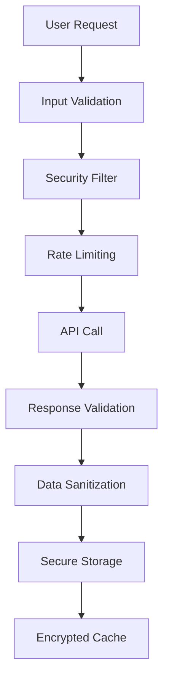
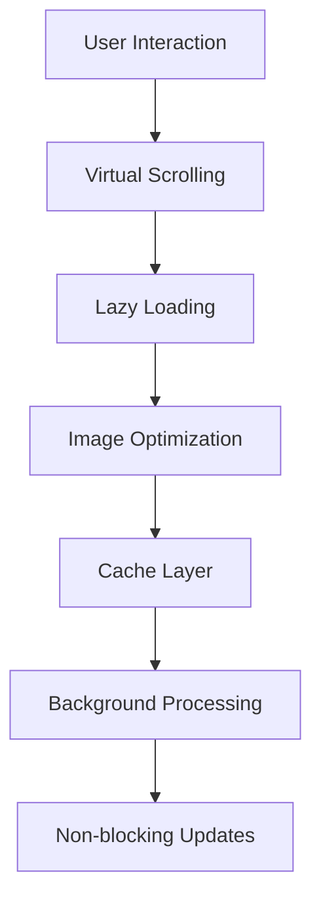

# 🌍 World Order Module - Product Requirements Document (PRD)

## 📋 Document Information

| Field | Value |
|-------|-------|
| **Document Version** | 1.0 |
| **Created Date** | December 2024 |
| **Last Updated** | December 2024 |
| **Status** | Draft |
| **Priority** | Critical |
| **Estimated Effort** | 3-4 weeks |

---

## 🎯 Executive Summary

### Problem Statement
The World Order Module, while functionally complete, contains **critical security vulnerabilities**, **performance issues**, and **zero test coverage** that make it unsuitable for production deployment. Immediate remediation is required to ensure user safety and system reliability.

### Solution Overview
This PRD outlines a comprehensive remediation plan to transform the World Order Module from a **proof-of-concept** into a **production-ready feature** with enterprise-grade security, performance, and reliability.

### Success Metrics
- **Security Score**: 9/10 (currently 5/10)
- **Performance Score**: 8/10 (currently 5/10)
- **Test Coverage**: 90%+ (currently 0%)
- **Production Readiness**: 95%+ (currently 60%)

---

## 🚨 Critical Issues Summary

### Security Vulnerabilities (CRITICAL)
- ❌ Unsafe external image loading
- ❌ Insecure JSON parsing without validation
- ❌ No Content Security Policy
- ❌ Unencrypted sensitive data in localStorage

### Performance Issues (HIGH)
- ❌ Inefficient DOM manipulation
- ❌ Heavy CSS animations causing jank
- ❌ Blocking API calls without timeouts
- ❌ Memory leaks from uncleaned intervals

### Testing Gaps (CRITICAL)
- ❌ Zero unit test coverage
- ❌ No integration testing
- ❌ No performance testing
- ❌ No error scenario testing

### Code Quality Issues (MEDIUM)
- ❌ Weak error handling
- ❌ Magic numbers and hardcoded values
- ❌ Poor maintainability
- ❌ Missing documentation

---

## 🎯 Product Requirements

### 1. Security Requirements

#### 1.1 Image Security (CRITICAL)
**Requirement**: Implement secure image handling with validation and CSP compliance.

**Acceptance Criteria**:
- [ ] All external images must be validated before loading
- [ ] Implement Content Security Policy for image sources
- [ ] Add image fallback mechanism for failed loads
- [ ] Implement image caching with integrity checks
- [ ] Add support for WebP/AVIF formats for performance

**Technical Implementation**:
```typescript
interface SecureImageConfig {
  allowedDomains: string[];
  maxFileSize: number;
  supportedFormats: string[];
  fallbackImage: string;
}

class SecureImageLoader {
  private config: SecureImageConfig;
  
  async loadImage(url: string): Promise<HTMLImageElement> {
    // Validate URL against allowed domains
    // Check file size and format
    // Implement fallback mechanism
  }
}
```

#### 1.2 Data Validation (CRITICAL)
**Requirement**: Implement comprehensive data validation for all external inputs.

**Acceptance Criteria**:
- [ ] JSON schema validation for AI responses
- [ ] Input sanitization for all user-generated content
- [ ] Type safety enforcement at runtime
- [ ] Malformed data rejection with proper error handling

**Technical Implementation**:
```typescript
import { z } from 'zod';

const NewsCardSchema = z.object({
  id: z.string().uuid(),
  headline: z.string().min(1).max(200),
  imageUrl: z.string().url(),
  source: z.string().min(1).max(100),
  timestamp: z.string().datetime(),
  summary: z.array(z.string()).length(5),
  category: z.string().min(1).max(50),
  sourceUrl: z.string().url(),
  credibility: z.number().min(1).max(10)
});

type NewsCard = z.infer<typeof NewsCardSchema>;
```

#### 1.3 Encryption & Storage Security (HIGH)
**Requirement**: Implement secure data storage with encryption.

**Acceptance Criteria**:
- [ ] Encrypt sensitive data before localStorage storage
- [ ] Implement data integrity validation
- [ ] Add secure key management
- [ ] Implement data expiration with automatic cleanup

### 2. Performance Requirements

#### 2.1 Virtual Scrolling (HIGH)
**Requirement**: Implement virtual scrolling for large news card lists.

**Acceptance Criteria**:
- [ ] Support for 1000+ news cards without performance degradation
- [ ] Smooth scrolling on mobile devices
- [ ] Memory usage under 50MB for large datasets
- [ ] 60fps scrolling performance

**Technical Implementation**:
```typescript
class VirtualizedNewsGrid {
  private container: HTMLElement;
  private itemHeight: number = 120;
  private visibleCount: number;
  private scrollTop: number = 0;
  
  render(cards: NewsCard[]): void {
    const startIndex = Math.floor(this.scrollTop / this.itemHeight);
    const endIndex = Math.min(startIndex + this.visibleCount, cards.length);
    
    // Render only visible cards
    this.renderVisibleCards(cards.slice(startIndex, endIndex), startIndex);
  }
}
```

#### 2.2 Animation Optimization (MEDIUM)
**Requirement**: Optimize CSS animations for better performance.

**Acceptance Criteria**:
- [ ] Use CSS transforms instead of layout properties
- [ ] Implement reduced motion support
- [ ] Optimize animation timing functions
- [ ] Add animation performance monitoring

#### 2.3 API Performance (HIGH)
**Requirement**: Implement non-blocking API calls with proper error handling.

**Acceptance Criteria**:
- [ ] Request timeout handling (30 seconds max)
- [ ] Retry mechanism with exponential backoff
- [ ] Request cancellation support
- [ ] Background processing for non-critical operations

### 3. Testing Requirements

#### 3.1 Unit Testing (CRITICAL)
**Requirement**: Achieve 90%+ test coverage for all components.

**Acceptance Criteria**:
- [ ] Test all public methods of ResearchEngine
- [ ] Test NewsCardComponent rendering and interactions
- [ ] Test ResearchScheduler timing logic
- [ ] Test error handling scenarios
- [ ] Mock all external dependencies

**Test Structure**:
```
src/
├── components/
│   └── modals/
│       ├── __tests__/
│       │   ├── worldOrderModal.test.ts
│       │   └── newsCard.test.ts
├── api/
│   └── __tests__/
│       └── researchEngine.test.ts
└── app/
    └── __tests__/
        └── researchScheduler.test.ts
```

#### 3.2 Integration Testing (HIGH)
**Requirement**: Test complete user workflows.

**Acceptance Criteria**:
- [ ] End-to-end research workflow testing
- [ ] API integration testing with mocked responses
- [ ] Cache behavior testing
- [ ] Error recovery testing

#### 3.3 Performance Testing (MEDIUM)
**Requirement**: Validate performance under various conditions.

**Acceptance Criteria**:
- [ ] Load testing with 100+ concurrent users
- [ ] Memory leak detection
- [ ] Performance benchmarking
- [ ] Mobile device testing

### 4. Code Quality Requirements

#### 4.1 Error Handling (HIGH)
**Requirement**: Implement comprehensive error handling with user-friendly messages.

**Acceptance Criteria**:
- [ ] Custom error types for different failure scenarios
- [ ] User-friendly error messages
- [ ] Error logging and monitoring
- [ ] Graceful degradation strategies

**Technical Implementation**:
```typescript
enum WorldOrderErrorType {
  API_FAILURE = 'API_FAILURE',
  NETWORK_ERROR = 'NETWORK_ERROR',
  PARSE_ERROR = 'PARSE_ERROR',
  CACHE_ERROR = 'CACHE_ERROR',
  VALIDATION_ERROR = 'VALIDATION_ERROR'
}

class WorldOrderError extends Error {
  constructor(
    public type: WorldOrderErrorType,
    message: string,
    public originalError?: Error,
    public userMessage?: string
  ) {
    super(message);
  }
}
```

#### 4.2 Configuration Management (MEDIUM)
**Requirement**: Externalize all configuration values.

**Acceptance Criteria**:
- [ ] Environment-based configuration
- [ ] Runtime configuration updates
- [ ] Feature flags support
- [ ] A/B testing capabilities

#### 4.3 Documentation (MEDIUM)
**Requirement**: Comprehensive documentation for all components.

**Acceptance Criteria**:
- [ ] JSDoc comments for all public methods
- [ ] API documentation
- [ ] User guide for configuration
- [ ] Troubleshooting guide

---

## 🏗️ Technical Architecture

### 4.1 Enhanced Component Structure

```
src/
├── types/
│   ├── worldOrder.ts          # Type definitions
│   └── errors.ts              # Error types
├── api/
│   ├── researchEngine.ts      # Enhanced research engine
│   ├── secureImageLoader.ts   # Secure image handling
│   └── dataValidator.ts       # Data validation
├── components/
│   ├── modals/
│   │   ├── worldOrderModal.ts # Enhanced modal
│   │   └── newsCard.ts        # Optimized card component
│   └── virtualized/
│       └── virtualizedGrid.ts # Virtual scrolling
├── services/
│   ├── cacheService.ts         # Enhanced caching
│   ├── configService.ts       # Configuration management
│   └── monitoringService.ts    # Performance monitoring
├── utils/
│   ├── security.ts            # Security utilities
│   ├── performance.ts         # Performance utilities
│   └── errorHandling.ts       # Error handling utilities
└── __tests__/
    ├── unit/                  # Unit tests
    ├── integration/           # Integration tests
    └── performance/           # Performance tests
```

### 4.2 Security Architecture



### 4.3 Performance Architecture



---

## 📅 Implementation Timeline

### Phase 1: Critical Security Fixes (Week 1)
**Priority**: CRITICAL
**Effort**: 40 hours

#### Day 1-2: Security Implementation
- [ ] Implement secure image loading
- [ ] Add JSON schema validation
- [ ] Create data sanitization utilities
- [ ] Add Content Security Policy

#### Day 3-4: Error Handling
- [ ] Create custom error types
- [ ] Implement comprehensive error handling
- [ ] Add user-friendly error messages
- [ ] Create error logging system

#### Day 5: Security Testing
- [ ] Security vulnerability testing
- [ ] Penetration testing
- [ ] XSS vulnerability scanning
- [ ] Data validation testing

### Phase 2: Performance Optimization (Week 2)
**Priority**: HIGH
**Effort**: 32 hours

#### Day 1-2: Virtual Scrolling
- [ ] Implement virtualized news grid
- [ ] Add smooth scrolling support
- [ ] Optimize memory usage
- [ ] Mobile performance testing

#### Day 3-4: Animation Optimization
- [ ] Optimize CSS animations
- [ ] Add reduced motion support
- [ ] Implement performance monitoring
- [ ] Add animation debugging tools

#### Day 5: API Optimization
- [ ] Add request timeouts
- [ ] Implement retry mechanisms
- [ ] Add request cancellation
- [ ] Background processing optimization

### Phase 3: Testing Implementation (Week 3)
**Priority**: HIGH
**Effort**: 40 hours

#### Day 1-2: Unit Testing
- [ ] Set up testing framework
- [ ] Write unit tests for all components
- [ ] Achieve 90%+ test coverage
- [ ] Add test automation

#### Day 3-4: Integration Testing
- [ ] End-to-end testing setup
- [ ] API integration testing
- [ ] Error scenario testing
- [ ] Performance testing

#### Day 5: Test Optimization
- [ ] Test performance optimization
- [ ] Add test monitoring
- [ ] Create test documentation
- [ ] Set up CI/CD testing

### Phase 4: Documentation & Polish (Week 4)
**Priority**: MEDIUM
**Effort**: 24 hours

#### Day 1-2: Documentation
- [ ] Write comprehensive JSDoc comments
- [ ] Create API documentation
- [ ] Write user guides
- [ ] Create troubleshooting guide

#### Day 3-4: Configuration Management
- [ ] Implement configuration system
- [ ] Add environment support
- [ ] Create feature flags
- [ ] Add monitoring dashboard

#### Day 5: Final Testing & Deployment
- [ ] Final security audit
- [ ] Performance benchmarking
- [ ] User acceptance testing
- [ ] Production deployment

---

## 🧪 Testing Strategy

### 5.1 Unit Testing Framework

```typescript
// Example test structure
describe('ResearchEngine', () => {
  let researchEngine: ResearchEngine;
  let mockAI: jest.Mocked<typeof ai>;
  
  beforeEach(() => {
    mockAI = {
      models: {
        generateContent: jest.fn()
      }
    };
    researchEngine = new ResearchEngine(mockAI);
  });
  
  describe('performDailyResearch', () => {
    it('should return valid news cards on successful API call', async () => {
      // Test implementation
    });
    
    it('should handle API errors gracefully', async () => {
      // Error handling test
    });
    
    it('should validate response schema', async () => {
      // Schema validation test
    });
  });
});
```

### 5.2 Integration Testing

```typescript
describe('World Order Module Integration', () => {
  it('should complete full research workflow', async () => {
    // End-to-end workflow test
  });
  
  it('should handle network failures', async () => {
    // Network failure testing
  });
  
  it('should maintain cache consistency', async () => {
    // Cache behavior testing
  });
});
```

### 5.3 Performance Testing

```typescript
describe('Performance Tests', () => {
  it('should handle 1000+ news cards', async () => {
    // Large dataset performance test
  });
  
  it('should maintain 60fps scrolling', async () => {
    // Animation performance test
  });
  
  it('should not leak memory', async () => {
    // Memory leak detection
  });
});
```

---

## 📊 Success Metrics

### 6.1 Security Metrics
- [ ] **Zero critical vulnerabilities** (currently 4)
- [ ] **100% input validation** coverage
- [ ] **A+ security rating** from security scanners
- [ ] **Zero XSS vulnerabilities** detected

### 6.2 Performance Metrics
- [ ] **< 100ms** initial load time
- [ ] **60fps** scrolling performance
- [ ] **< 50MB** memory usage for 1000+ cards
- [ ] **< 2s** API response time

### 6.3 Quality Metrics
- [ ] **90%+ test coverage** (currently 0%)
- [ ] **Zero linting errors**
- [ ] **A+ code quality** rating
- [ ] **100% TypeScript** strict mode compliance

### 6.4 User Experience Metrics
- [ ] **< 3s** time to interactive
- [ ] **Zero layout shifts** during loading
- [ ] **Smooth animations** on all devices
- [ ] **Accessible** to screen readers

---

## 🚀 Deployment Strategy

### 7.1 Staging Deployment
1. **Security Audit**: Complete security review
2. **Performance Testing**: Load testing with 100+ users
3. **Integration Testing**: Full workflow testing
4. **User Acceptance Testing**: Internal team validation

### 7.2 Production Deployment
1. **Feature Flags**: Gradual rollout with feature toggles
2. **Monitoring**: Real-time performance and error monitoring
3. **Rollback Plan**: Immediate rollback capability
4. **User Communication**: Clear communication about new features

### 7.3 Post-Deployment
1. **Monitoring**: 24/7 monitoring for first week
2. **Performance Tracking**: Continuous performance monitoring
3. **User Feedback**: Collect and analyze user feedback
4. **Iterative Improvements**: Regular updates based on data

---

## 🔧 Configuration Management

### 8.1 Environment Configuration

```typescript
interface WorldOrderConfig {
  api: {
    timeout: number;
    retries: number;
    baseUrl: string;
  };
  cache: {
    duration: number;
    maxSize: number;
    encryption: boolean;
  };
  security: {
    allowedImageDomains: string[];
    cspPolicy: string;
    encryptionKey: string;
  };
  performance: {
    virtualScrolling: boolean;
    animationReduced: boolean;
    lazyLoading: boolean;
  };
  features: {
    enableResearch: boolean;
    enableCaching: boolean;
    enableMonitoring: boolean;
  };
}
```

### 8.2 Feature Flags

```typescript
const featureFlags = {
  virtualScrolling: process.env.NODE_ENV === 'production',
  animationOptimization: true,
  secureImageLoading: true,
  performanceMonitoring: true,
  errorReporting: true
};
```

---

## 📈 Monitoring & Analytics

### 9.1 Performance Monitoring

```typescript
class PerformanceMonitor {
  trackPageLoad(): void {
    // Track initial load performance
  }
  
  trackScrollPerformance(): void {
    // Track scrolling performance
  }
  
  trackAPIPerformance(): void {
    // Track API call performance
  }
  
  trackMemoryUsage(): void {
    // Track memory usage
  }
}
```

### 9.2 Error Monitoring

```typescript
class ErrorMonitor {
  trackError(error: WorldOrderError): void {
    // Track and report errors
  }
  
  trackSecurityIncident(incident: SecurityIncident): void {
    // Track security incidents
  }
  
  trackPerformanceIssue(issue: PerformanceIssue): void {
    // Track performance issues
  }
}
```

---

## 🎯 Acceptance Criteria

### 10.1 Security Acceptance
- [ ] All external resources validated before loading
- [ ] No XSS vulnerabilities detected
- [ ] All user inputs sanitized
- [ ] Sensitive data encrypted in storage
- [ ] Content Security Policy implemented

### 10.2 Performance Acceptance
- [ ] Initial load time < 100ms
- [ ] Smooth 60fps scrolling
- [ ] Memory usage < 50MB for 1000+ items
- [ ] No memory leaks detected
- [ ] Mobile performance optimized

### 10.3 Quality Acceptance
- [ ] 90%+ test coverage achieved
- [ ] All tests passing
- [ ] Zero linting errors
- [ ] TypeScript strict mode compliance
- [ ] Comprehensive documentation

### 10.4 User Experience Acceptance
- [ ] Intuitive user interface
- [ ] Accessible to all users
- [ ] Responsive design
- [ ] Error handling with user-friendly messages
- [ ] Smooth animations and transitions

---

## 📋 Risk Assessment

### 11.1 High-Risk Items
- **Security vulnerabilities** could lead to data breaches
- **Performance issues** could impact user experience
- **Testing gaps** could lead to production failures
- **Memory leaks** could cause system instability

### 11.2 Mitigation Strategies
- **Security**: Implement comprehensive security testing
- **Performance**: Continuous performance monitoring
- **Testing**: Automated testing pipeline
- **Memory**: Regular memory leak detection

---

## 📞 Stakeholder Communication

### 12.1 Development Team
- **Daily standups** during implementation
- **Weekly progress reports**
- **Technical documentation** updates
- **Code review** requirements

### 12.2 Product Team
- **Weekly status updates**
- **Feature demonstration** sessions
- **User feedback** collection
- **Release planning** coordination

### 12.3 Security Team
- **Security review** sessions
- **Vulnerability assessment** reports
- **Penetration testing** coordination
- **Security training** requirements

---

## 🏁 Conclusion

This PRD outlines a comprehensive plan to transform the World Order Module from a **proof-of-concept** into a **production-ready feature**. The implementation will address all critical security vulnerabilities, performance issues, and testing gaps while maintaining the existing functionality.

**Key Success Factors**:
1. **Security first** approach
2. **Comprehensive testing** strategy
3. **Performance optimization** focus
4. **User experience** prioritization
5. **Continuous monitoring** and improvement

**Expected Outcome**: A secure, performant, and reliable World Order Module that meets enterprise-grade standards and provides an excellent user experience.

---

## 📎 Appendices

### Appendix A: Security Checklist
- [ ] Input validation implemented
- [ ] Output encoding applied
- [ ] Authentication mechanisms secure
- [ ] Authorization properly implemented
- [ ] Data encryption in transit and at rest
- [ ] Error handling doesn't leak information
- [ ] Logging and monitoring in place
- [ ] Security headers configured
- [ ] Content Security Policy implemented
- [ ] Regular security updates

### Appendix B: Performance Checklist
- [ ] Page load time optimized
- [ ] Resource loading optimized
- [ ] Database queries optimized
- [ ] Caching strategy implemented
- [ ] CDN configured
- [ ] Image optimization applied
- [ ] Code splitting implemented
- [ ] Lazy loading enabled
- [ ] Memory usage optimized
- [ ] Network requests minimized

### Appendix C: Testing Checklist
- [ ] Unit tests written
- [ ] Integration tests implemented
- [ ] End-to-end tests created
- [ ] Performance tests conducted
- [ ] Security tests performed
- [ ] Accessibility tests completed
- [ ] Cross-browser testing done
- [ ] Mobile testing performed
- [ ] Load testing conducted
- [ ] User acceptance testing completed
